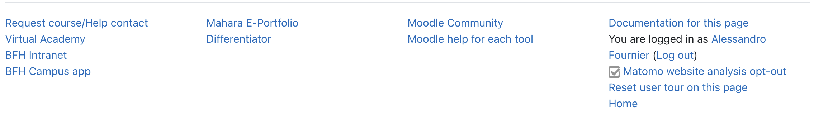

[](https://github.com/lucaboesch/moodle-filter_bfhfooter/actions/workflows/moodle-plugin-ci.yml)
# BFH Footer #

The aim of this plugin is to add a multi column footer to the Moodle site running Boost Union with some dynamic elements.
In the last column of that footer, there is first the "Documentation for this page" link (styled without arrow icon or ⓘ) where available,
then the login info (You are not logged in. (Log in)/You are logged in as John Doe (Log out)),
then, the opt-out/opt-in link to the Matomo web analytics is featured.
Finally, where available, the user tour link is added to the column.

To let appear correctly, theme_boost_union | enablefooterbutton should be set to "Hide on all devices".
In filter_bfhfooter | footertext the first three `<div class="col-sm-3">` rows
of the footer have to be insert, and in theme_boost_union | footnote the text `<p>bfhfootnote</p>` should be inserted
(that is the string that gets replaced by the filter).

To let the user tours link appear as normal footer text, it has to undo the pop-up styling
of the user tour link, which is done by adding the following CSS to the theme:

```
.tool_usertours-resettourcontainer .usertour {
 padding: 0 !important;
  border-bottom: none !important;
}
```



## Installing via uploaded ZIP file ##

1. Log in to your Moodle site as an admin and go to _Site administration >
   Plugins > Install plugins_.
2. Upload the ZIP file with the plugin code. You should only be prompted to add
   extra details if your plugin type is not automatically detected.
3. Check the plugin validation report and finish the installation.

## Installing manually ##

The plugin can be also installed by putting the contents of this directory to

    {your/moodle/dirroot}/filter/bfhfooter

Afterwards, log in to your Moodle site as an admin and go to _Site administration >
Notifications_ to complete the installation.

Alternatively, you can run

    $ php admin/cli/upgrade.php

to complete the installation from the command line.

## License ##

2026 Luca Bösch <luca.boesch@bfh.ch>

This program is free software: you can redistribute it and/or modify it under
the terms of the GNU General Public License as published by the Free Software
Foundation, either version 3 of the License, or (at your option) any later
version.

This program is distributed in the hope that it will be useful, but WITHOUT ANY
WARRANTY; without even the implied warranty of MERCHANTABILITY or FITNESS FOR A
PARTICULAR PURPOSE.  See the GNU General Public License for more details.

You should have received a copy of the GNU General Public License along with
this program.  If not, see <https://www.gnu.org/licenses/>.
